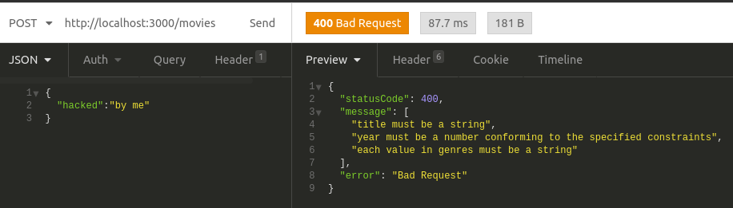
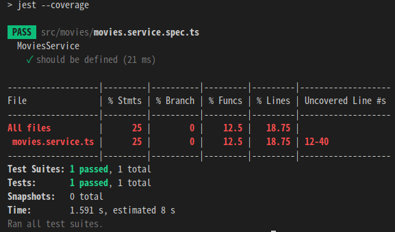
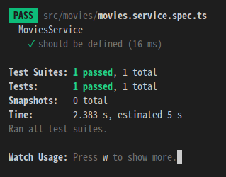
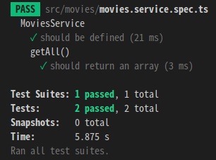
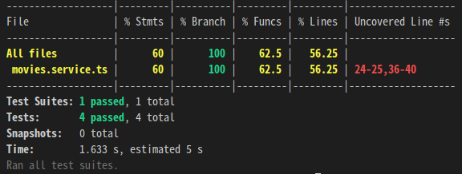
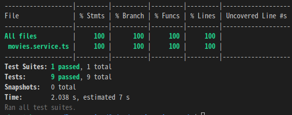

# NestJS API Example

이 레포지토리는 노마드코더의 [NestJS로 API 만들기](https://nomadcoders.co/nestjs-fundamentals)를 수강하고 정리한 레포지토리입니다.

## 0. Instroduction

### NestJS

NestJS는 Node.js의 express와 fastify 위에서 돌아가는 프레임워크이다.
Java에는 Spring이 있듯이 언어마다 프레임워크가 존재한다.
Spring처럼 Node.js보다 좀 더 구조적이고 엄격한 규칙을 적용한다.
기업들이 선호하는 프레임워크이다.

### [Project Setup](https://docs.nestjs.com/)

- Nest CLI 설치, 새 프로젝트 생성

  ```bash
  npm cache clean --force
  sudo npm i -g source-map-resolve
  sudo npm i -g @nestjs/cli
  nest new project_name
  ```

- 프로젝트 실행

  ```bash
  npm run start:dev
  http://localhost:3000 으로 접속
  ```

## 1. NestJS의 구조

Spring과 마찬가지로 계층적 구조를 가진다.  
NestJS는 컨트롤러를 비지니스 로직과 구분 짓고 싶어한다.  
컨트롤러는 url을 가져오는 역할만 한다.  
비지니스 로직은 서비스가 담당한다.  
서비스는 일반적으로 실제 function을 가지는 부분이다.

- main (main.ts)
  모든 것의 루트 모듈과 같다.

  ```ts
  // bootstrap은 함수 이름으로 아무거나 써도 된다.
  async function bootstrap() {
    const app = await NestFactory.create(AppModule);
    await app.listen(3000); // 3000번 포트로 리스닝을 시작한다.
  }
  bootstrap();
  ```

- module(app.module.ts)
  하나의 모듈을 정의하는 계층
  ```ts
  // @Module : 어떤 역할을 하는 함수인지 명시한다. 데코레이터로 Spring의 Annotation과 비슷하다.
  @Module({
    imports: [],
    controllers: [AppController], // 컨트롤러 명시
    providers: [AppService], // 서비스 명시
  })
  export class AppModule {} // AppModule 클래스는 비어있는 것처럼 보이지만 사실 @Module 함수가 안에 있다.
  ```
- controller(app.controller.ts)
  URL을 통해 요청이 오면 그것을 처리하는 계층.  
   express의 라우터와 같다.

  ```ts
  @Controller()
  export class AppController {
    constructor(private readonly appService: AppService) {}

    @Get() // Get 요청 방식
    getHello(): string {
      return this.appService.getHello();
    }
    @Get('/:id')
    getOne(@Param('id') identity: string /*이 변수는 다른 이름을 쓸수 있다.*/) {
      // Param 데코레이터를 써야 정상적으로 인식한다.
      return `This will return one movie with the id: ${identity}`;
    }
  }
  ```

- service
  비즈니스 로직을 처리하는 계층.
  ```ts
  // 가장 내부에 있는 층으로 데이터를 컨트롤러에 전달하는 역할을 한다.
  @Injectable()
  export class AppService {
    getHello(): string {
      return 'Hello World!';
    }
  }
  ```

## 2. Rest API

### Nest CLI 활용하기

#### 사용 가능한 명령어 목록 확인

```bash
nest
```

#### Controller 생성

```bash
nest g controller
? What name would you like to use for the controller? movies
```

컨트롤러 생성하면 movies/movies.controller.ts가 생성되고,  
app.module.ts에 다음과 같이 MoviesController가 자동으로 추가되었음을 알 수 있다.

```ts
@Module({
  imports: [],
  controllers: [MoviesController],
  providers: [],
})
```

### Decorators

- Module : 모듈 정의
- Controller: 컨트롤러 정의
- Injectable: 의존성 주입이 가능한 클래스 정의
- Get: Get 방식 요청 컨트롤러 정의(Read)
- Post: Post 방식 요청 컨트롤러 정의(Create)
- Delete: Delete 방식 요청 컨트롤러 정의(Delete)
- Patch: Patch 방식 요청 컨트롤러 정의(Update) -> 일부분만 업데이트
- Put: Put 방식 요청 컨트롤러 정의(Update) -> 전체 업데이트
- Query: URL에서 "movies/search?year=2000" 처럼 ?뒤에 들어오는 쿼리를 받을 때 사용
  ```ts
  @Get('search')
  search(@Query('year') searchingYear: string) {
      return `We are search for a movie made after ${searchingYear}`;
  }
  ```
- Param: URL에서 "movies/1" 처럼 슬래시를 기준으로 들어오는 파라미터를 받을 때 사용
  ```ts
  @Get('/:id')
  getOne(@Param('id') movieId: string) {
      return `This will return one movie with the id: ${movieId}`;
  }
  ```
- Body: Post, Delete, Patch, Put 요청 시 함께 들어오는 Request Body 데이터를 받을 때 사용
  ```ts
  @Patch('/:id') // Update
  patch(@Param('id') movieId: string, @Body() updateData) {
      return {
      updatedMovie: movieId,
      ...updateData,
      };
  }
  ```
- Req: HttpRequest 객체를 받을 수 있다. (express가 아닌 fastify위에서 NestJs가 동작 시 사용 안하는 것을 추천)
- Res: HttpResponse 객체를 받을 수 있다. (express가 아닌 fastify위에서 NestJs가 동작 시 사용 안하는 것을 추천)

### 예외 처리

사용자가 DB에 없는 정보를 요청했을 경우 다음과 같이 예외를 던지면 404 http status를 응답한다.

```ts
// movies.service.ts
getOne(id: string): Movie {
  const movie = this.movies.find(movie => movie.id === +id); //+는 parseInt와 같음
  if (!movie) {
    throw new NotFoundException(`Movie with ID ${id} not found.`);
  }
  return movie;
}
```

### 유효성 검사

Request body에 유효하지 않은 데이터가 넘어오는 것을 방지해야한다.

```bash
npm i class-validator class-transformer @nestjs/mapped-types
```

다음과 같이 DTO를 생성하고, IsString 같은 validator로 유효성 검사를 한다.

```ts
// movies/dto/create-movie.dto.ts
export class CreateMovieDto {
  @IsString()
  readonly title: string;
  @IsNumber()
  readonly year: number;
  @IsString({ each: true })
  readonly genres: string[];
}
```

```ts
// movies/dto/update-movie.dto.ts
// UpdateMovieDto는 CreateMovieDto와 구조가 똑같다.
// 단 모든 변수가 필수사항이 아니라는 점만 다르다.
// 이럴 때, PartialType을 사용하여 간단히 만들 수 있다.
export class UpdateMovieDto extends PartialType(CreateMovieDto) {}
```

컨트롤러와 서비스에 request body의 타입을 dto로 명시한다.

```ts
// movies/movies.controller.ts
@Post()
create(@Body() movieData: CreateMovieDto) {}
```

메인 모듈에 Validation Pipe를 사용하겠다고 선언한다.

```ts
// main.ts
async function bootstrap() {
  const app = await NestFactory.create(AppModule);
  // 유효성 검사를 도와주는 파이프 설정
  app.useGlobalPipes(
    new ValidationPipe({
      whitelist: true, // 유효하지 않은 데이터는 컨트롤러로 아예 도달하지 못하도록 함
      forbidNonWhitelisted: true, // 유효하지 않은 데이터를 받으면 리퀘스트 자체를 막는다.
      transform: true, // 사용자가 보낸 데이터를 컨트롤러에 명시된 타입으로 자동으로 변환해줌. 예를 들어 id같은 경우 url로 넘어와서 string인데 컨트롤러에 명시된 타입이 number 타입이면 number로 자동 변환됨.
    }),
  );
  await app.listen(3000);
}
```

유효성 검사 결과
</img>

### Dependency Injection

#### 컨트롤러에서 서비스 주입하기

```ts
// movies.module.ts
@Module({
  // ...
  providers: [MoviesService], // providers에 MoviesService를 명시(의존성 주입하겠다는 뜻)
})
```

```ts
// movie.service.ts
@Injectable() // 서비스에 의존성 주입이 가능하다고 명시
export class MoviesService {}
```

```ts
//movies.controller.ts
constructor(private readonly movieService: MoviesService/*타입을 반드시 명시해야 주입 가능*/) {}
// this.movieService로 서비스 접근 가능
```

## 3. Unit Testing

Unit Testing : 여러 개의 함수 단위로 테스트하는 것.

- jest는 자바스크립트를 아주 쉽게 테스팅하는 npm 패키지이다.
- NestJS에서는 세팅이 자동으로 된다.
- 만약 movies.service.ts파일을 테스트하고 싶다면 movies.service.spec.ts파일이 있어야한다.
- jest는 spec.ts 파일들만을 찾아서 .ts 파일을 테스트를 하는데 도움을 준다.

### jest --convergae

코드가 얼마나 테스팅 됐는지, 안 됐는지 알려준다.

```bash
npm run test:cov
```

</img>  
12.5 퍼센트의 Function, 18.75퍼센트의 라인, 12~40번까지의 라인은 테스팅되지 않았다고 나왔다.

### jest --watch

watch 모드로 테스트 할 수 있다.

```bash
npm run test:watch
# a를 눌러서 모든 테스트 수행
```

</img>  
모든 테스트가 통과되었다.

### 단위 테스트 작성하기

- describe: 테스트를 묘사하는 함수
- beforeEach: 단위 테스트 하나하나마다 실행 하기 전에 한 번씩 실행하는 함수
- beforeAll: 모든 단위 테스트를 실행 하기 전에 한 번만 실행하는 함수. 데이터베이스가 단위 테스트마다 초기화되지 않게 하기 위해서 사용
- it(individual test): 실제 개별 테스트를 하는 함수
- expect: 로직의 값이 어떤 값이 될 것이라고 예측하는 함수

```ts
// movies.service.spec.ts

describe('MoviesService', () => {
  let service: MoviesService;

  beforeEach(async () => {
    const module: TestingModule = await Test.createTestingModule({
      providers: [MoviesService],
    }).compile();

    service = module.get<MoviesService>(MoviesService);
  });

  it('should be defined', () => {
    expect(service).toBeDefined();
  });

  describe('getAll()', () => {
    it('should return an array', () => {
      const result = service.getAll();
      expect(result).toBeInstanceOf(Array);
    });
  });
});
```

</img>

테스트를 진행하고 나서 다시 `npm run test:cov`를 입력하면 테스트 범위가 증가한 것을 알 수 있다.  
</img>

모든 코드에 대해 테스트를 작성했을 경우 다음과 같이 테스트 범위가 100%가 된다.
</img>

## 4. end-to-end(e2e) testing

e2e: 모든 시스템을 테스팅하는 것.
웹페이지를 테스트할 때 사용하고, 사용자 관점에서 확인할 때 사용한다.

### e2e 테스트 시작하기

```bash
npm run test:e2e
```

### e2e 테스트 작성하기

- get, post, patch, delete: 실제 url로 요청을 보내는 함수
- todo: 테스트 해야할 목록 생성
- send: Request body에 json 형태로 값을 전송하는 함수
- expect: 서버에서 응답한 Http status를 예상하거나, 서버에서 응답한 데이터를 예상하는 함수

```ts
// test/app.e2e-spec.ts
import * as request from 'supertest';

describe('AppController (e2e)', () => {
  let app: INestApplication;

  beforeEach(async () => {
    const moduleFixture: TestingModule = await Test.createTestingModule({
      imports: [AppModule],
    }).compile();

    app = moduleFixture.createNestApplication();
    await app.init();
  });

  // 사용자가 요청을 보냈을 때의 관점으로 테스트를 한다.
  it('/movies (GET)', () => {
    return request(app.getHttpServer())
      .get('/movies')
      .expect(200) // Http status 200
      .expect([]); // 빈 영화 배열 예상
  });

  describe('/movies/:id', () => {
    it('PATCH 200', () => {
      return request(app.getHttpServer())
        .patch('/movies/1')
        .send({
          title: 'Updated Test',
        })
        .expect(200);
    });
    it('DELETE 200', () => {
      return request(app.getHttpServer())
        .delete('/movies/1')
        .expect(200);
    });
  });
});
```

### 테스트 시 주의사항

실제 `npm run start:dev` 에서 실행되는 서버와 테스트 서버는 다르다.
따라서, 테스팅 환경도 실제 구동 환경의 설정을 그대로 적용시켜줘야 한다.
예를 들어 url의 타입을 controller의 파라미터 타입으로 변환시키는 모듈을 테스트 서버에도 다음과 같이 적용시켜야한다.

```ts
// main.ts

async function bootstrap() {
  const app = await NestFactory.create(AppModule);
  app.useGlobalPipes(
    new ValidationPipe({
      // ... 생략
      transform: true, // 변환 옵션
    }),
  );
  await app.listen(3000);
}
```

```ts
// app.e2e-spec.ts

beforeAll(async () => {
  const moduleFixture: TestingModule = await Test.createTestingModule({
    imports: [AppModule],
  }).compile();
  app = moduleFixture.createNestApplication();
  app.useGlobalPipes(
    new ValidationPipe({
      // ... 생략
      transform: true, // 변환 옵션
    }),
  );
  await app.init();
});
```
